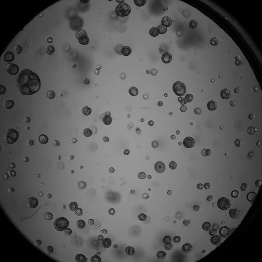
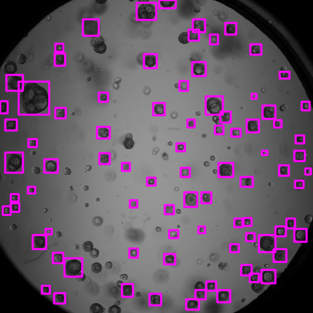
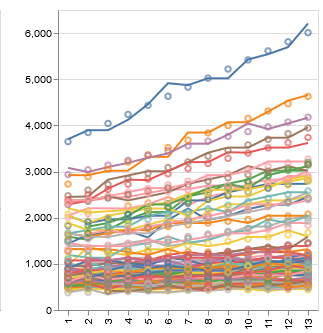
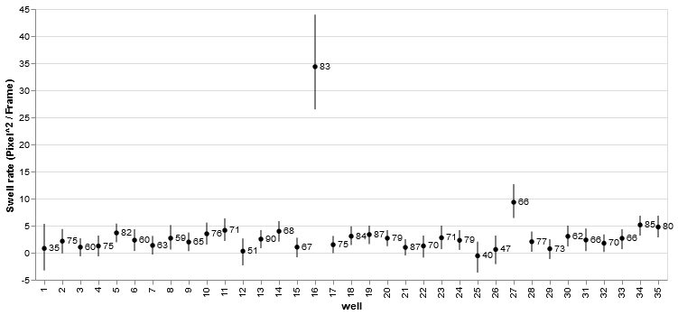

# OrgaSwell
This repository contains a multistep algorithm to detect swelling of mini-organs (organoids) in subsequent microscopy images (movie). All notebooks are specifically written for deployement using [Google Colab](https://colab.research.google.com).

# Organoid Detection
First, organoids are detected using the [organoid_recognition.ipynb](./organoid_recognition.ipynb) notebook. In this notebook, organoids are detected for each frame of the microscopy movie. A pre-trained neural network [OrgaQuant](https://github.com/TKassis/OrgaQuant), described in this [open-access paper](https://www.nature.com/articles/s41598-019-48874-y), is used for organoid detection.

Microscopy Image | Detected Organoids 
:-:|:-:
 | 

# Swell estimation
In a second [post_processing.ipynb](./post_processing.ipynb), we estimate the average swell rate of the detected organoids in the movie. First, we use particle tracking to track the location of each organoids . Next, we use linear regression to quantify swelling of each organoid. Using the swell rate of each organoid, we can estimate the average swell rate of all organoids in a movie.

Particle Tracking | Swell regression | Swell Rates
:-:|:-:|:-:
 |  | 
x, y position for each organoid in all 13 movie frames | Linear regression to estimate the swell rate of all detected organoids in the movie | The mean swell rate of multiple movies. No organoid swelling is observed for most wells, however, clear swelling organoids is observed in well 16.
